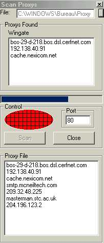



## Proxy File Scanner

### Description

Proxy Scanner

have created a program that solves the proxy challenge,No More subnet scan... Proxy Scanner is a free open source program that allows you to connect through several proxies at once to see if they work and if they work then will be added to a new list... check it out and give me feed back please...this is a challange for all those VB Pro Programmers why not IMPROVE this proggie and show your capabilities.
 
### More Info
 

             |
---                |---
**Submitted On**   |2001-05-16 13:52:24
**By**             |[mini](https://github.com/Planet-Source-Code/PSCIndex/blob/master/ByAuthor/mini.md)
**Level**          |Intermediate
**User Rating**    |4.7 (47 globes from 10 users)
**Compatibility**  |VB 6\.0
**Category**       |[Internet/ HTML](https://github.com/Planet-Source-Code/PSCIndex/blob/master/ByCategory/internet-html__1-34.md)
**World**          |[Visual Basic](https://github.com/Planet-Source-Code/PSCIndex/blob/master/ByWorld/visual-basic.md)
**Archive File**   |[Proxy File196705162001\.zip](https://github.com/Planet-Source-Code/mini-proxy-file-scanner__1-23216/archive/master.zip)

